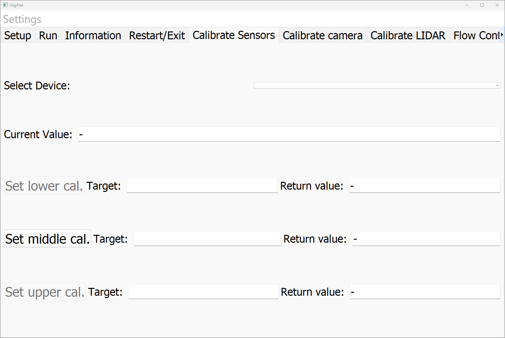

# Calibrate Sensors Tab

**Purpose**  
The purpose of the "Calibrate Sensors" tab is to empower the scientist to calibrate his or her device. To date, only the sensors of Atlas Scientific are supported.

**Visual Overview**  

**Work Flow**  
1. Select a sensor. Usually, at least one of the following are selectable: pH, ORP (oxygen redox potential), EC (eletrical conductivity), or RTD (resistance temperature device). A value should be shown beside Current Value.
2. Place the corresponding sensor in the calibration solution, e.g. the pH sensor into the buffer solution of pH=7.
3. Press "Set middle cal."
4. Place the corresponding sensor in the calibration solution for the lower end of the calibration range, e.g. the pH sensor into the buffer solution of pH=4.
5. Press "Set lower cal."
6. Place the corresponding sensor in the calibration solution for the upper end of the calibration range, e.g. the pH sensor into the buffer solution of pH=10.
7. Press "Set upper cal."

* More details on the callibration procedure of Atlas scientific devices can be found in their website, for example [here](https://atlas-scientific.com/blog/how-to-calibrate-the-ezo-complete-ph-using-the-atlas-desktop-software/).