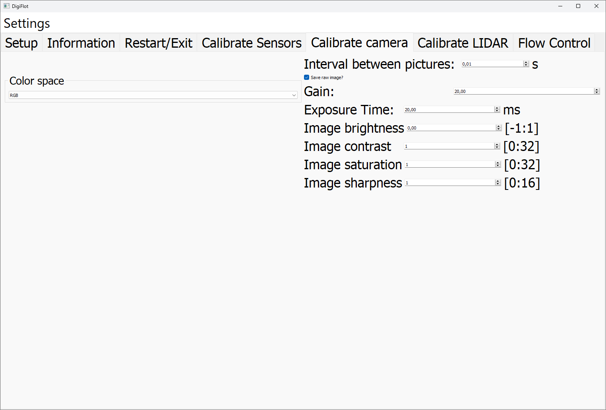

# Calib Cam Tab

**Purpose**  
This tab is an interface for the camera settings and the camera image.

**Settings**  
The setting shown here only hold for the Raspberry Pi Cameras and are connected to the Picamera2 library in the backend of the software.

The settings are:  
- picture interval: refresh interval of the image fetch process
- gain: sets the analogue gain (1.0 to ~22.0); the higher the gain, the brighter the image at the cost of the SNR
- exposure time: 40 µs - 10 seconds; the higher the exposure time, the brighter the image at the cost of more pronounced movement artifacts
- image brightness, contrast, saturation, sharpness ... best to be left at default as this can be modified later with, for example, open-cv.
- color space: allows for setting the color space of the shown image. **Yet, images are always stored as RGB**

