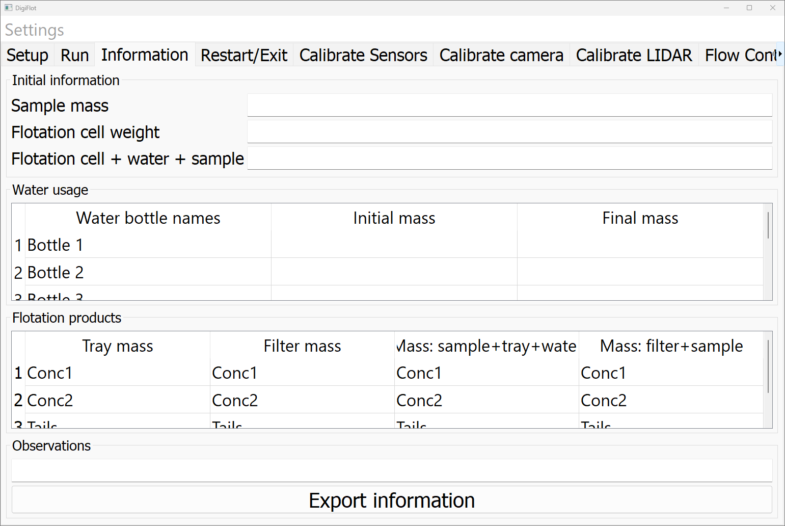

# Information Tab

**Purpose**  
The information tab serves as an interface for documenting information that are crucial for the post-experimental analysis, such as the sample mass and the tray masses.

**Visual Overview**  

**Work Flow**  
1. Enter initial information in the upper panel, i.e. sample mass, flotation cell weight, and the weight of the flotation cell, its water content and the sample combined
2. Document the water usage in the middle panel by entering the intial and final mass of the bottles
3. Enter all the information about the flotation products, e.g. the tray mass and the filter mass, collected at each flotation stage and the tails