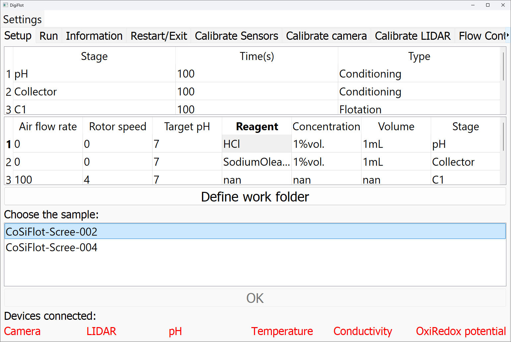

# Setup

**Purpose**

The setup tab allows for initializing a specific experimental run with the sample-specific configuration files, i.e. samples.csv, scheme.csv, and "some sample name from samples.csv".csv.

**Visual Overview**

**Work Flow**

1. Select the working folder (the folder with the samples.csv, scheme.csv, and the sample-specific csv files.
2. Select the sample by clicking onto its name and then pressing OK.